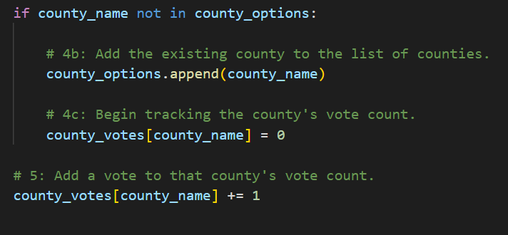

# Election_Analysis

## Overview of Election Audit
We were tasked by a Colorado Board of Elections employee to complete an election audit for a local congressional election. To complete this audit we will have to provide a breakdown of the performance by county and candidate as well as determine the winner of the election. We will be writing a python script that will run the provided csv file and output the data we are looking for into a txt file.

## Election Audit Process

**1. The total number of votes cast.**

For this we looped through each row after the header row and each time it looped we added 1 to the total_votes which counted the total number of votes cast.

**2. A complete list of candidates who received votes.**

After setting candidate_options as a list and candidate_votes as a dictionary, within the same for loop we used for the total votes, we went through each candidate name down the column labeled “Candidate” using candidate_name = row[2]. Then we ran an if statement for “not in candidate_options list” and if True append candidate_name to the list to candidate_options list.

**3. The percentage of votes each candidate won.**

Also written in the for loop running down the rows we counted the number of times that candidate_name appeared in the csv. We did this within the if statement by setting the candidate_votes to 0 every time a new candidate_name we started. We then added 1 every time the loop ran until the next candidate_name (as seen in Image 2). After we knew the number of votes per candidate we wrote a formula to count the votes each candidate received and divided it by the number of total votes established in task 1. We then times it by 100 to make it a percent and added it to the candidate_results f string all with the number of votes (task 4).

**4. The total number of votes each candidate won.**

As seen in the image from task 3. When we counted the number of candidate_votes we were able to get that number and have reference for the percentage per candidate (task 3) as well as referenced in the candidate_results f string. This line would result in “Candidate Name: percent of votes (total votes)” and run for each candidate.

**5. The winner of the election based on popular vote.**

To determine the winner we ran an if statement to check if the candidate's current vote count is greater than the winning count. Earlier we set the winning count to 0. We did the same thing for the vote_percentage > winning_percentage and added it to the if statement as an “and” condition. If the statement is true it would assign winning variables from the vote_count, candidate_name, and vote_percentage which would be used in the winning_candidate_summary f string to print. This would result in Charles Casper Stockham’s vote count and percentage both being greater than 0 which would print, but that would be overwritten by Diana DeGette having a higher vote count and percentage than Charles Casper Stockham. This would result in printing Diana Dette’s name, vote count, and vote percentage in the winner section. Lastly this would be run for Raymon Anthony Doane which would fail in the if statement and be skipped because Raymon Anthony Doane did not have a higher vote count and percentage than Diana Dette.

**6. The voter turnout for each county.**

To track voter turnout for each county we first had to set the county_name to the column labeled “County” and create an empty list for county_options. We then followed the same format as the candidate with an if statement to create a county list and count the votes per county. Then we ran each county_name in a for loop for each county. This allows us to get the vote_count for each county_name and use that for the county_results f string.

**7. The percentage of votes from each county.**

As seen in the above image while we’re establishing the vote_count per county we run a formula to determine the percent of the vote each county contributed. This is then used as the reference in the county_results f string for each county_name. These then print out as “County Name: percentage of voters (total county votes)” for each county.

**8. The county with the highest turnout.**

To get the county with the largest turnout we will run an if statement similar to the one ran for the winning candidate, but this time we will check if the vote_count is greater than the county_turnout which was earlier set to 0. This will result in Jefferson County’s vote_count being greater than 0 but eventually be overwritten by Denver County because its vote_count is greater than Jefferson. It will stay printed as Denver because after running for Arapahoe it would fail because Denver has a greater vote_count.

## Election Audit Results
The election analysis shows:
- There were 369,711 votes cast in the election.
- The county voter turnout was:
  - Jefferson County had 10.5% of the voter turnout with 38,855 voters.
  - Denver County had 82.8% of the voter turnout with 306,055 voters.
  - Arapahoe County had 6.7% of the voter turnout with 24,801 voters.
- Denver County had the largest number of votes with 306,055 votes cast.
- The candidates were:
  - Charles Casper Stockham
  - Diana DeGette
  - Raymon Anthony Doane
- The candidate results were:
  - Candidate Charles Casper Stockham received 23.0% of the vote and 85,213 votes.
  - Candidate Diana DeGette received 73.8% of the vote and 272,892 votes.
  - Candidate Raymon Anthony Doane received 3.1% of the vote and 11,606 votes.
- The winner of the election was:
  - Candidate Diana DeGette, who received 73.8% of the vote and 272,892 votes.

## Election-Audit Summary
If needed for the future this script could be modified to summarize the results for other elections. For example if the file being referenced could be updated to the new file with the structure in the data, perhaps this would be good for the next local congressional election or other congressional elections for a different precinct. The data could also be summarized from towns, states, or any other characteristic that could be collected during the election. This would require a variable change to fit the new characteristic we want broken down as well as updated f string text for the new characteristic. We could also layer on another column with this information and have the correct index for the column if the new characteristic was provided in the data in an additional column right of the current data. This could be for County and Town.

