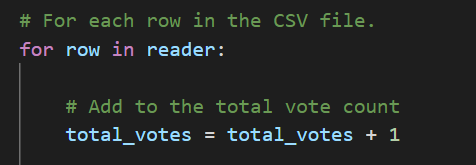

# Election_Analysis

## Overview of Election Audit
We were tasked by a Colorado Board of Elections employee to complete an election audit for a local congressional election. To complete this audit we will have to provide a break down of the performance by county and candidate as well as determine the winner of the election. We will be writting a python script that will run the provided csv file and output the data we are looking for into a txt file.

## Election Audit Process

**1. The total number of votes cast.**
Count the rows starting after the header row

**2. A complete list of candidates who received votes.**

Got candidate name from the value in column C via candidate_name = row[2]
Made cadidate list with not duplicate names via candidate_options.append(candidate_name)

**3. The percentage of votes each candidate won.**

**4. The total number of votes each candidate won.**

**5. The winner of the election based on popular vote.**

**6. The voter turnout for each county.**

**7. The percentage of votes from each county.**

**8. The county with the highest turnout.**

## Election Audit Results
The election analysis shows:
- There were 369,711 votes cast in the election.
- The county voter turnout was:
  - Jefferson County had 10.5% of the voter turnout with 38,855 voters.
  - Dnever County had 82.8% of the voter turnout with 306,055 voters.
  - Arapahoe County had 6.7% of the voter turnout with 24,801 voters.
- Dnever County had the largest number of votes with 306,055 votes cast.
- The candidates were:
  - Charles Casper Stockham
  - Diana DeGette
  - Raymon Anthony Doane
- The candidate results were:
  - Candidate Charles Casper Stockham received 23.0% of the vote and 85,213 number of votes.
  - Candidate Diana DeGette received 73.8% of the vote and 272,892 number of votes.
  - Candidate Raymon Anthony Doane received 3.1% of the vote and 11,606 number of votes.
- The winner of the election was:
  - Candidate Diana DeGette, who recevied 73.8% of the vote and 272,892 number of votes.

## Election-Audit Summary
If needed for the future this script could be modified to summarize the results for other elections. For example if the file being referenced could be updated to the new file with the structure in the data, perhaps this would be good for next local congressional election or other congressional elections for a different precinct. The data could also be summarized from towns, states, or any other characterisitc that could be collected during the election. This would require a variable change to fit the new characteristic we want broken down as well as updated f string text for the new characteristic. We could also layer on another column with this information and have the correct index for the column if the new characteristic was provided in the data in an additional column right of the current data. This could be for County and Town.

